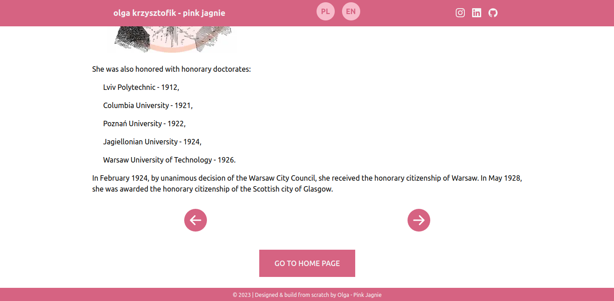

# ☀️ Summer of code 2023

### About

A project created as part of the SummerOfCode challenge organized by FlyNerd.
The topic of the first week was HTML&CSS. I decided to expand this topic and create a project learning about new technologies.

And so I created a page dedicated to Maria Skłodowska-Curie. It contains her biography divided into eight sections and a quiz where you can test your knowledge about the Nobel Prize winner.

The application was created using:

- Next.JS,
- JavaScript,
- Tailwind (includes RWD),
- React Icons,
- LottieFiles
- and with i18next I implemented multilingualism - Polish and English (also in the quiz).

The project includes:

- the main menu view, where you can go to individual sections of the biography,
- each of the subpages of the biography, apart from the text, contains graphics or animation,
- navigation at the bottom of each page - go to the previous section, go to the next section, go back to the main page,
- a quiz where you can test yourself. It consists of five questions, and at the end a summary of how you did.

- Content comes from Wikipedia. -

### Preview

###### Home page

###### View of subpage in Polish

###### View of the same subpage in English

###### View of bottom of subpage with navigation

###### View of quiz page

###### View of quiz questions

###### View of quiz summary

